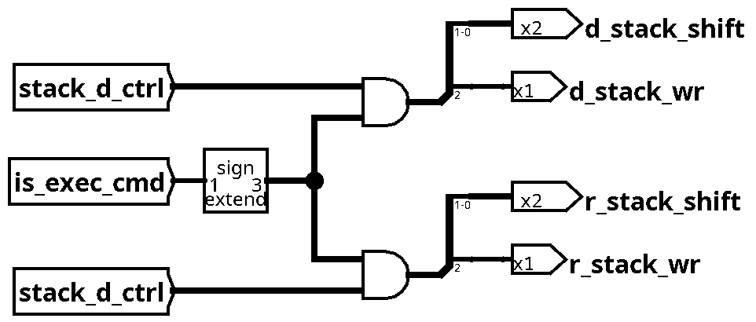
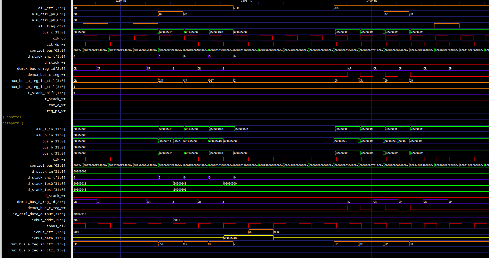

# Лабораторная работа №3, Архитектура компьютера

- Выполнил
    - Бардин Петр Алексеевич, P3219, 367079
- Преподаватель
    - Пенской Александр Владимирович
- `forth | stack | neum | mc | instr | binary | stream | port | pstr | prob1 | cache`
- Базовый вариант

Реализация потактового симулятора стекового 32-битного процессора с микропрограммным управлением.

Симулятор выполнен с применением фреймворка MyHDL.

<!-- TOC -->
* [Лабораторная работа №3, Архитектура компьютера](#лабораторная-работа-3-архитектура-компьютера)
  * [Обзор архитектуры](#обзор-архитектуры)
    * [Исполнение микрокода](#исполнение-микрокода)
    * [Control unit](#control-unit)
    * [Datapath](#datapath)
    * [Функционирование модуля памяти](#функционирование-модуля-памяти)
    * [Функционирование модуля стека](#функционирование-модуля-стека)
    * [Схемы](#схемы)
      * [Control unit](#control-unit-1)
      * [Datapath](#datapath-1)
  * [Структура микрокоманд](#структура-микрокоманд)
    * [Jump](#jump)
    * [Exec](#exec)
    * [Описания управляющих сигналов микрокоманды](#описания-управляющих-сигналов-микрокоманды)
      * [Типы полей:](#типы-полей)
  * [Ассемблер микрокода](#ассемблер-микрокода)
    * [CLI микроассемблера](#cli-микроассемблера)
    * [ISA](#isa)
      * [Структура:](#структура)
      * [Список команд:](#список-команд)
  * [Подсистема ввода-вывода](#подсистема-ввода-вывода)
    * [Устройство](#устройство)
    * [Процесс обмена данными](#процесс-обмена-данными)
      * [Запись](#запись)
      * [Чтение](#чтение)
    * [Реализованные устройства](#реализованные-устройства)
  * [Память](#память)
    * [Основная память](#основная-память)
    * [Виды адресации](#виды-адресации)
    * [Стеки](#стеки)
    * [Регистры](#регистры)
      * [ПЗУ микрокода](#пзу-микрокода)
  * [Язык Forth](#язык-forth)
    * [Грамматика в форме Бэкуса-Наура:](#грамматика-в-форме-бэкуса-наура)
    * [Принцип работы](#принцип-работы)
    * [Типы данных](#типы-данных)
    * [Области видимости](#области-видимости)
    * [Встроенные слова](#встроенные-слова)
      * [Литералы](#литералы)
      * [Определение переменных](#определение-переменных)
      * [Определение констант](#определение-констант)
      * [Определение строк](#определение-строк)
      * [Определение собственного слова:](#определение-собственного-слова)
      * [Оператор if, if-else](#оператор-if-if-else)
      * [Цикл for](#цикл-for)
      * [Цикл while](#цикл-while)
      * [Цикл do-while](#цикл-do-while)
      * [Встроенные слова](#встроенные-слова-1)
    * [Лексер и парсер](#лексер-и-парсер)
    * [Транслятор](#транслятор)
    * [Представление в памяти и линковка](#представление-в-памяти-и-линковка)
    * [CLI транслятора](#cli-транслятора)
  * [Симулятор](#симулятор)
    * [Тестирование](#тестирование)
    * [Задача cat (подробно)](#задача-cat-подробно)
    * [Задача hello](#задача-hello)
    * [Задача hello_user_name](#задача-hellousername)
    * [Задача prob1](#задача-prob1)
      * [Дополнительные тесты](#дополнительные-тесты)
    * [CLI Симулятора](#cli-симулятора)
<!-- TOC -->

## Обзор архитектуры

### Исполнение микрокода

Микрокоманды исполняются последовательно из ПЗУ микрокода,
в зависимости от бита типа может присутствовать условный переход. Исполнение начинается с нулевого адреса.

Размер микрокоманды всегда 64 бит, но реально используется меньше:

- exec: _42 бит_
- jump: _44 бит_

Формат команд горизонтально-вертикальный, есть поддержка
групп сигналов с множественной активацией (кодируются 1 по биту на сигнал) и
с единичной активацией (кодируются по номеру для уменьшения объема).

Устройство управления по переднему фронту тактового импульса загружает последовательно микрокоманды из ПЗУ,
по заднему фронту происходит либо инкремент MC_PC,
либо для микрокоманд ветвления сравнение шины C с условием перехода и изменение MC_PC.


Типы микрокоманд по представляемым возможностям:
- exec
    1. чтение регистров или памяти в шины А, В
    2. выполнение операции АЛУ, установка значения в шине C
    3. управление стеком
    4. запись в регистры, память или верх стека
    5. управление IO
- jump
    1. выполнение операции на АЛУ с возможностью чтения регистров и памяти, выдача данных на шину C (как пункты 1 и 2 exec)
    2. выполнение условного перехода в микрокоде
        - проверка сравнением одного выбранного бита шины C после АЛУ с булевым значением в команде
        - переход по абсолютному адресу

Микрокод процессора расположен в [файле](src/machine/mc/code/main.mcasm).

<details>

<summary>Листинг микрокода</summary>

```
start:

# fetch instruction from RAM to CR, increase IP
infetch:
(IP ADD) -> AR;
(DR ADD) -> CR;
(IP(INC) ADD) -> IP;

# execute command according to opcode of CR[31:20]
exec:

# group select of CR[31:28]
switch (CR ADD)[30:28] {

  #GIOC
  case 0b000 {
    if (CR ADD)[21] == 0 {
      if (CR ADD)[20] == 1 jmp end; # 0b01 NOP
      # 0b00 HLT
      ctrl(halt);
    } else {
      # IO instructions
      (DST(TKW) ADD) io(set_addr), pop(D);
      if (CR ADD)[20] == 0 {
        # 0b10 IN  [addr] -> [val]
        io(req_read);
        (IOR ADD) io(get_data), push(D);
      } else {
        # 0b11 OUT [val, addr] -> []
        (DST ADD) io(set_data), pop(D);
        io(req_write);
      };
    };
  }

  # GMTH
  case 0b001 {
    switch (CR ADD)[23:20] {
      # ADD
      case 0b0000 { (DSS ADD DST) poprep(D); }
      # SUB
      case 0b0001 { (DSS ADD DST(INC,NOT)) poprep(D); }
      # DIV
      case 0b0010 { (DSS DIV DST) poprep(D); }
      # MUL
      case 0b0011 { (DSS MUL DST) poprep(D); }
      # MOD
      case 0b0100 { (DSS MOD DST) poprep(D); }
      # AND
      case 0b0101 { (DSS AND DST) poprep(D); }
      # OR
      case 0b0110 { (DSS OR DST) poprep(D); }
      # INV (~x)
      case 0b0111 { (DST(NOT) ADD) rep(D); }
      # INC
      case 0b1000 { (DST(INC) ADD) rep(D); }
      # DEC
      case 0b1001 { (DST ADD Z(NOT)) rep(D); }
      # NEG (-x)
      case 0b1010 { (DST(NOT,INC) ADD) rep(D); }
    };
  }

  # GSTK
  case 0b010 {
    # (CR ADD)[16] is stack id (0=D, 1=R),
    # meaning is stack to operate on, or source stack for two-stack operation

    switch (CR ADD)[22:20] {
      # ISTKPSH
      case 0b0000 {
        if (CR ADD)[16] == 0  { (CR(TKW,SXTW) ADD) push(D); }
        else                  { (CR(TKW,SXTW) ADD) push(R); };
      }

      # STKMV src[a];dst[] -> src[];dst[a]   (ctrl/stackid is src)
      case 0b0001 {
        if (CR ADD)[16] == 0  { (DST ADD) push(R), pop(D); }
        else                  { (RST ADD) push(D), pop(R); };
      }

      # STKCP src[a];dst[] -> src[a];dst[a]   (ctrl/stackid is src)
      case 0b0010 {
        if (CR ADD)[16] == 0  { (DST ADD) push(R); }
        else                  { (RST ADD) push(D); };
      }

      # STKPOP [a] -> []
      case 0b0011 {
        if (CR ADD)[16] == 0  { (ZERO) pop(D); }
        else                  { (ZERO) pop(R); };
      }

      # STKDUP [a] -> [a, a]
      case 0b0101 {
        if (CR ADD)[16] == 0  { (DST ADD) push(D); }
        else                  { (RST ADD) push(R); };
      }

      # STKOVR [a,b] -> [a,b,a]
      case 0b0100 {
        if (CR ADD)[16] == 0  { (DSS ADD) push(D); }
        else                  { (RSS ADD) push(R); };
      }

      # STKSWP [a,b] -> [b,a]
      case 0b0110 {
        if (CR ADD)[16] == 0  {
          (DSS ADD) push(R);
          (DST ADD) poprep(D);
          (RST ADD) push(D), pop(R);
        } else {
          (RSS ADD) push(D);
          (RST ADD) poprep(R);
          (DST ADD) push(R), pop(D);
        };
      }
    };
  }

  # GCMP
  # PS is [...VCNZ]
  case 0b011 {
    # bit 20 selects operand order (0 for LTx, 1 for GTx, then GTx is LTx with reversed ops)
    if (CR ADD)[20] == 0  { (DSS ADD DST(NOT,INC)) set(Z,V,C,N); }
    else                  { (DST ADD DSS(NOT,INC)) set(Z,V,C,N); };

    if (CR ADD)[22] == 1 {
      # CEQ (b100)
      (PS AND Z(INC)) poprep(D); # push z flag, it is leftmost
    } else {
      # CLTx, CGTx (b0XX)
      # here implementing only "less" variant

      if (CR ADD)[21] == 0 {
        # Unsigned version
        # C <=> "<"
        if (PS ADD)[2] == 0 { jmp cmp_ltx_exit_poprep_1; }
        else                { jmp cmp_ltx_exit_poprep_0; };
      } else {
        # Signed version
        # V^C <=> "<"
        switch (PS ADD)[4:2] { # extract VC part and implement xor
          case 0b00 { jmp cmp_ltx_exit_poprep_0; }
          case 0b11 { jmp cmp_ltx_exit_poprep_0; }
          case 0b01 { jmp cmp_ltx_exit_poprep_1; }
          case 0b10 { jmp cmp_ltx_exit_poprep_1; }
        };
      };

      # here using jmp to push 0/1 to exit from all nested ifs
      # with only one command instead of sequence to speedup,
      # as there is no optimization currently in flattening process
      cmp_ltx_exit_poprep_0:
      (Z ADD) poprep(D);
      jmp exec_end;

      cmp_ltx_exit_poprep_1:
      (Z(INC) ADD) poprep(D);
    };
  }

  # GJMP
  case 0b100 {
    switch (CR ADD)[22:20] {
      # AJMP
      case 0b000 {
        (DST ADD) -> IP, pop(D);
      }

      # RJMP
      case 0b001 {
        (CR(TKW,SXTW) ADD IP) -> IP;
      }

      # CJMP jump IP-relative if DST==0
      case 0b010 {
        if (DST ADD)[0] == 1 jmp cjmp_end;
        (CR(TKW,SXTW) ADD IP) -> IP;
        cjmp_end:
        pop(D);
      }

      # RCALL
      case 0b011 {
        (IP ADD) push(R);
        (CR(TKW,SXTW) ADD IP) -> IP;
      }

      # RET
      case 0b100 {
        (RST ADD) -> IP, pop(R);
      }
    };
  }

  # GMEM
  case 0b101 {
    switch (CR ADD)[20:20] {
      # FETCH [addr] -> [val]
      case 0b0 {
        (DST(TKW) ADD) -> AR;
        (DR ADD) rep(D);
      }

      # STORE [val,addr] -> []
      case 0b1 {
        (DST(TKW) ADD) -> AR, pop(D);
        (DST ADD) -> DR, pop(D);
        store;
      }
    };
  }
};

exec_end:

# final
end:
jmp start;

```


</details>

Принцип работы микрокода:

- загрузка инструкции по IP в CR
- инкремент IP
- последовательные проверки битов CR для определения команды по opcode
- исполнение микрокода команды
- переход в начало

### Control unit

[Код модуля](src/machine/mc/components/control.py).

Состоит из 2х основных частей:

- MCSequencer
    - по переднему фронту тактирования загружает микрокоманды из памяти в `control_bus`
    - по заднему фронту тактирования меняет счетчик микрокоманд и делает переходы
    - генерация тактирования для datapath (на чтение и на запись)
- набор декодеров (ALUDecoder, RegReadDecoder, RegWriteDecoder, StackDecoder)
    - выделение из `control_bus` сигналов на отдельные компоненты расписанные далее в соответствии с фронтом импульса и
      последовательностью управления

Основные сигналы управления:

| сигналы                                      | описание                          |
|----------------------------------------------|-----------------------------------|
| alu_ctrl                                     | оператор АЛУ                      |
| alu_ctrl_pa, alu_ctrl_pb                     | функции на входе в АЛУ            |
| alu_flag_ctrl, reg_ps_wr                     | установка флагов АЛУ, запись в PS |
| mux_bus_a_reg_in_ctrl, mux_bus_b_reg_in_ctrl | выбор источника для шин А и В     |
| r_stack_shift, r_stack_wr                    | сдвиги запись стека R             |
| d_stack_shift, d_stack_wr                    | сдвиги запись стека D             |
| demux_bus_c_reg_id                           | выбор получателя данных с шины C  |
| ram_a_wr                                     | выполнение записи в память        |

### Datapath

[Код модуля](src/machine/datapath/datapath.py).

Основой процессора является АЛУ, которое подключено к системным шинам A, B - входным, и С - выходной.

При выполнении микрокоманды первый этап - по переднему фронту загрузка операндов в шины A, B,
для этого в соответствии с `mux_bus_*_reg_in_ctrl` ([BusInCtrl](src/machine/arch.py)) мультиплексируются в шины A и B
выходы регистров, значений со стека (по 2 верхних значения каждого стека выдаются всегда из модуля стека),
и из памяти (по переднему фронту в выходном регистре данных памяти всегда данные по адресу AR).

По заднему фронту защелкиваются защелки на входных шинах перед АЛУ,
его операция определяется `alu_ctrl` ([ALUCtrl](src/machine/arch.py)), при этом перед вычислением основной функции
над каждым операндом можно провести предварительно набор операций `alu_ctrl_p*` ([ALUPortCtrl](src/machine/arch.py)).

Далее все по заднему фронту синхроимпульса записи, значение с шины С нужно демультиплексором
по `demux_bus_c_reg_id` ([BusOutCtrl](src/machine/arch.py)) передать
либо на входы регистров, либо на модули стеков, либо в КВУ.
Установка `demux_bus_c_reg_wr` позволяет выполнить запись в регистры,
`ram_a_wr` - в память (если в AR уже установлен адрес в прошлых команде и
в этой команде выход шины С выбран на регистр данных модуля памяти).
Сигналы `*_stack_wr` и `*_stack_shift` напрямую передаются модулям стека, о нем в следующем разделе.
АЛУ также выдает флаги, которые при установке `alu_flag_ctrl` и `reg_ps_wr` записываются в PS.

Основные сигналы данных:

| сигналы                 | описание                                                                      |
|-------------------------|-------------------------------------------------------------------------------|
| bus_*                   | шины A, B, C                                                                  |
| alu_*_in                | входы с шин A, B с регистра перед АЛУ                                         |
| reg_\<name>_*           | сигналы входа, выхода и записи в регистр                                      |
| reg_drw_*, ram_drr      | входной и выходной регистр данных памяти                                      |
| \<name>_stack_tos\<pos> | выходы со стека \<name> верхнего (pos=0) или второго с верху (pos=1) значения |
| \<name>_stack_in        | вход данных в модуль стека \<name>                                            |
| io_ctrl_data_output     | выходной регистр данных КВУ                                                   |

### Функционирование модуля памяти

[Код модуля](src/machine/components/RAM.py).

По переднему фронту модуль выставляет на шину данных значение из памяти по адресу на шине адреса.

По заднему фронту модуль записывает в память значение
с шины данных по адресу на шине адреса при установке разрешающего сигнала.

### Функционирование модуля стека

[Код модуля](src/machine/components/ExtendedStack.py).

Выводы tos0, tos1 отображают 2 значения от вершины стека из регистрового файла при изменении указателя стека,
выводы full и empty соответственно показывают факт заполнения стека до максимума и его пустоту.

Сдвиг происходит при установке значения `in_shift` допускающего сдвиги +1, -1 и 0.
Запись в регистры проходит только в верх стек после сдвигов по заднему фронту при установленном `wr_top`.

### Схемы

Схемы сделаны при помощи ПО Logisim Evolution, проект прилагается.

Все логические компоненты напрямую отражаются в идентичные в коде модели.
На схемах представлены только основные модули системы,
в частности, не присутствуют те, в которых для симуляции есть несинтезируемые операции из Python.
Сигналы на схемах заименованы в соответствии с моделью.

<details>

<summary>Схемы</summary>

#### Control unit

Загрузка микрокоманд и переходы


Предварительное декодирование микрокоманды


Декодеры управления стеком



Декодеры управления памятью и регистрами


#### Datapath

Основной вычислительный модуль, обвязка АЛУ


Входной мультиплексор АЛУ (две симметричные схемы, в именах Х соответствует шине А или В)


Базовые регистры и управление флагами PS


Модуль памяти, его регистровая обвязка и модуль контроллера IO


Модули стека


</details>


## Структура микрокоманд

Микрокоманды имеют структурное представление в виде объектов python с полями,
и бинарное представление.

Для соотнесения бинарного представления декодированному представлению
(т.е. для вычисления диапазона бит каждого поля) используется структуры `MCLocator`
определенные в файле [mcisa](src/machine/mc/mcisa.py) для каждого поля, они вычисляют автоматически местоположение
исходя из того, какой тип данных или перечисление используется.
Отражение же полей структуры к локаторам сделано аннотациями основных классов `MCInstruction`
в файле [mcinstr](src/machine/mc/mcinstr.py).

Далее будет табличное представление полей для каждого вида микрокоманд.


### Jump

| Loc     | Size   | Type        | Name            | Description                                                                |
|---------|--------|-------------|-----------------|----------------------------------------------------------------------------|
| [ 0: 1) | 1b     | MCType      | instr_type      | Тип инструкции                                                             |
| [ 1: 5) | 4b     | ALUCtrl     | alu_ctrl        | Управление операций АЛУ                                                    |
| [ 5:12) | 7b     | ALUPortCtrl | alu_port_a_ctrl | Операция на входе А АЛУ                                                    |
| [12:19) | 7b     | ALUPortCtrl | alu_port_b_ctrl | Операция на входе B АЛУ                                                    |
| [19:23) | 4b     | BusInCtrl   | bus_a_in_ctrl   | Выбор источника данных для шины А                                          |
| [23:27) | 4b     | BusInCtrl   | bus_b_in_ctrl   | Выбор источника данных для шины В                                          |
| [27:32) | 5b     | int         | jmp_cmp_bit     | Бит для компаратора при сравнении для условного перехода                   |
| [32:33) | 1b     | bool        | jmp_cmp_val     | Значение бита сравнения для условного перехода, при котором он совершается |
| [33:44) | 11b    | int         | jmp_target      | Смещение в микро-инструкциях для условного перехода                        |

### Exec

| Loc     | Size   | Type          | Name            | Description                          |
|---------|--------|---------------|-----------------|--------------------------------------|
| [ 0: 1) | 1b     | MCType        | instr_type      | Тип инструкции                       |
| [ 1: 5) | 4b     | ALUCtrl       | alu_ctrl        | Управление операций АЛУ              |
| [ 5:12) | 7b     | ALUPortCtrl   | alu_port_a_ctrl | Операция на входе А АЛУ              |
| [12:19) | 7b     | ALUPortCtrl   | alu_port_b_ctrl | Операция на входе B АЛУ              |
| [19:23) | 4b     | BusInCtrl     | bus_a_in_ctrl   | Выбор источника данных для шины А    |
| [23:27) | 4b     | BusInCtrl     | bus_b_in_ctrl   | Выбор источника данных для шины В    |
| [27:28) | 1b     | ALUFlagCtrl   | alu_flag_ctrl   | Управление сохранением флагов АЛУ    |
| [28:31) | 3b     | BusOutCtrl    | bus_c_out_ctrl  | Выбор получателя значения с шины C   |
| [31:32) | 1b     | MemCtrl       | mem_ctrl        | Управление записью в память          |
| [32:35) | 3b     | StackCtrl     | stack_d_ctrl    | Управление стеком данных             |
| [35:38) | 3b     | StackCtrl     | stack_r_ctrl    | Управление стеком возврата           |
| [38:39) | 1b     | MachineCtrl   | machine_ctrl    | Управление исполнением               |
| [39:42) | 3b     | MachineIOCtrl | io_ctrl         | Управление контроллером ввода-вывода |


### Описания управляющих сигналов микрокоманды

<details>

<summary>Листинг</summary>

#### Типы полей:

```python
class BusInCtrl(CEnumS):
    Z = 0  # ноль
    PS = 0b0001  # регистр PS
    DR = 0b0010  # регистр вывода данных из памяти
    IOR = 0b0011  # регистр вывода данных из IO контроллера
    DST = 0b0100  # значение вершины стека D
    DSS = 0b0101  # значение под вершиной стека D
    RST = 0b0110  # значение вершины стека R
    RSS = 0b0111  # значение под вершиной стека R
    IP = 0b1000  # регистр IP
    CR = 0b1001  # регистр CR
```

```python
class BusOutCtrl(CEnumS):
    Z = 0b000  # нет записи
    PS = 0b001  # запись в PS
    DR = 0b010  # запись во входной регистр данных памяти
    AR = 0b011  # запись в AR
    DS = 0b100  # передача входного значения в контроллер стека D
    RS = 0b101  # передача входного значения в контроллер стека R
    IP = 0b110  # запись в IP
    CR = 0b111  # запись в CR
```

```python
class MemCtrl(CEnumS):
    IGN = 0  # нет записи
    WR = 1  # запись в память
```

```python
class ALUCtrl(CEnumS):
    """
    Операции АЛУ
    """
```

```python
class ALUPortCtrl(CEnumM):
    """
    Набор операций применяемый к порту АЛУ перед вычислением, множественный выбор
    """
```

```python
class ALUFlagCtrl(CEnumS):
    NONE = 0  # не менять PS
    WRITE = 1  # сохранить флаги в PS
```

```python
class StackCtrl(CEnumS):
    """
    биты 0-1 определяют сдвиг вершины стека
    бит 2 отвечает за произведение записи после сдвига в вершину (1 - запись)
    """
```

```python
class MachineCtrl(CEnumM):
    HALT = 0b1  # остановить исполнение
```

```python
class MachineIOCtrl(CEnumS):
    NONE = 0
    SET_ADDR = 1  # начало взаимодействия, выбрать адрес
    SET_DATA = 2  # записать данные в контроллер перед передачей
    GET_DATA = 3  # получить данные из контроллера после получения
    REQ_READ = 4  # отправить запрос на чтение
    REQ_WRITE = 5  # отправить данные устройству
```

</details>


## Ассемблер микрокода

Для удобства написания [микрокода процессора](src/machine/mc/code/main.mcasm)
был разработан язык ассемблера, его парсер и ассемблер.

Примеров кода не будет, проще смотреть сразу микрокод процессора.

Для упрощения задачи используется парсер Lark,
грамматика языка в его формате доступна в [файле](src/mcasm/uasm.lark).

Каждая строка микроассемблера транслируется в одну микрокоманду.

Для работы с АЛУ формат следующий:

`(BUS_A(A_CTRL,...) CTRL BUS_B(B_CTRL,...)) -> BUS_C`

где BUS_A, BUS_B - источники данных для шин А И В, BUS_C - куда записать из шины C,
CTRL - определяет операцию АЛУ, A_CTRL и B_CTRL - операции входов АЛУ.

Для управления стеками предусмотрены команды
`push(x), pop(x), poprep(x), rep(x)` где `x` это буква стека R или D.

Для записи в память есть команда `store`.

Для управления контроллером IO команды `io(x)` где x - операция для КВУ.

Есть метки строк, их можно использовать при выполнении команд `jump`.

Микрокоманда jump описывается следующим образом:

`if <ALU>[<BIT>] == <VAL> jmp <LABEL>`

где ALU это блок управления АЛУ как выше, но без записи,
BIT и VAL - условия сравнения, LABEL - метка для перехода

Присутствуют макросы для структур `if` и `switch`.
`switch` разворачивается во вложенные `if`, а `if` в два блока кода и условный переход.
`switch` позволяет проверить не один бит, а сразу диапазон бит,
и перейти в нужную ветку уже по выбранному числовому, а не битовому значению.

### CLI микроассемблера

```shell
$ ./src/mcasm/mccompile.py --help
usage: mccompile.py [-h] [-p] [-b] [-j JSON] input_file

Microcode ASM parser & compiler

positional arguments:
  input_file            ASM file path

options:
  -h, --help            show this help message and exit
  -p, --parse           Only parse and print source microcommands as Python objects
  -b, --bin             Compile print binary encoded instructions
  -j JSON, --json JSON  Compile and output binary to file
```

### ISA

- Длина фиксированная 32 бит вне зависимости от наполнения
- Код операции представлен 2 логическими блоками `group` и `alt`,
  технически это одно поле 12бит, но группировка может позволить
  структурно отразить общий функционал микрокода каждой группы.
    - в микрокоде парсинг происходит только отдельных используемых битов каждого из полей
- Команда может иметь `immediate` операнд
    - загрузка всегда с расширением знака до 32 бит
    - при его отсутствии поле игнорируется
- Команда имеет поле для конфигурирования исполнения команды `ctrl`
    - `ctrl[0]` задает основной стек, при 0 - стек данных, при 1 - стек возврата.
      Вторичный стек выбирается как `~ctrl[0]`. Допустимо в группе `GSTK`
    - возможность использования полей регламентируется только микрокодом конкретной команды
      и обозначается в таблице в столбце параметров (`SEL` это управление стеком)

#### Структура:

Кодирование бинарное по заданной схеме в 32-битное слово:

| location | (32:28]      | (28:20]    | (20:16] | (16:0]    |
|:---------|--------------|------------|---------|-----------|
| name     | opcode group | opcode alt | ctrl    | immediate |
| size     | 4b           | 8b         | 4b      | 16b       |

#### Список команд:


<details>

<summary>Таблица</summary>

|      |         |   Group |   Alt | Params     | Base stack eff          | Other stack eff   | Effect                             |
|------|---------|---------|-------|------------|-------------------------|-------------------|------------------------------------|
| GIOC | HLT     |    0000 |  0000 |            |                         |                   | stop machine                       |
| GIOC | NOP     |    0000 |  0001 |            |                         |                   | no operation                       |
| GIOC | IN      |    0000 |  0010 |            | [ reg ] -> [ val ]      |                   | val <= IO[reg]                     |
| GIOC | OUT     |    0000 |  0011 |            | [ val; reg ] -> [  ]    |                   | IO[reg] <= val                     |
| GMTH | ADD     |    0001 |  0000 |            | [ a; b ] -> [ a+b ]     |                   |                                    |
| GMTH | SUB     |    0001 |  0001 |            | [ a; b ] -> [ a-b ]     |                   |                                    |
| GMTH | DIV     |    0001 |  0010 |            | [ a; b ] -> [ a/b ]     |                   |                                    |
| GMTH | MUL     |    0001 |  0011 |            | [ a; b ] -> [ a*b ]     |                   |                                    |
| GMTH | MOD     |    0001 |  0100 |            | [ a; b ] -> [ a%b ]     |                   |                                    |
| GMTH | AND     |    0001 |  0101 |            | [ a; b ] -> [ a&b ]     |                   |                                    |
| GMTH | OR      |    0001 |  0110 |            | [ a; b ] -> [ a\|b ]    |                   |                                    |
| GMTH | INV     |    0001 |  0111 |            | [ a ] -> [ ~a ]         |                   |                                    |
| GMTH | INC     |    0001 |  1000 |            | [ a ] -> [ a+1 ]        |                   |                                    |
| GMTH | DEC     |    0001 |  1001 |            | [ a ] -> [ a-1 ]        |                   |                                    |
| GMTH | NEG     |    0001 |  1010 |            | [ a ] -> [ -a ]         |                   |                                    |
| GSTK | ISTKPSH |    0010 |  0000 | IMM16, SEL | [  ] -> [ IMM ]         |                   |                                    |
| GSTK | STKMV   |    0010 |  0001 | SEL        | [ a ] -> [  ]           | [  ] -> [ a ]     |                                    |
| GSTK | STKCP   |    0010 |  0010 | SEL        | [ a ] -> [ a ]          | [  ] -> [ a ]     |                                    |
| GSTK | STKPOP  |    0010 |  0011 | SEL        | [ a ] -> [  ]           |                   |                                    |
| GSTK | STKOVR  |    0010 |  0100 | SEL        | [ a; b ] -> [ a; b; a ] |                   |                                    |
| GSTK | STKDUP  |    0010 |  0101 | SEL        | [ a ] -> [ a; a ]       |                   |                                    |
| GSTK | STKSWP  |    0010 |  0110 | SEL        | [ a; b ] -> [ b; a ]    |                   |                                    |
| GCMP | CLTU    |    0011 |  0000 |            | [ a; b ] -> [ a<b ]     |                   | uses C flag, F=0, T=1              |
| GCMP | CGTU    |    0011 |  0001 |            | [ a; b ] -> [ a>b ]     |                   | same                               |
| GCMP | CLTS    |    0011 |  0010 |            | [ a; b ] -> [ a<b ]     |                   | uses V^C flag, F=0, T=1            |
| GCMP | CGTS    |    0011 |  0011 |            | [ a; b ] -> [ a>b ]     |                   | same                               |
| GCMP | CEQ     |    0011 |  0100 |            | [ a; b ] -> [ a==b ]    |                   | uses Z flag, F=0, T=1              |
| GJMP | AJMP    |    0100 |  0000 |            | [ addr ] -> [  ]        |                   | IP <= addr                         |
| GJMP | RJMP    |    0100 |  0001 | IMM16      |                         |                   | IP <= IP + IMM                     |
| GJMP | CJMP    |    0100 |  0010 | IMM16      | [ val ] -> [  ]         |                   | if val[0] == 0 then IP <= IP + IMM |
| GJMP | RCALL   |    0100 |  0011 | IMM16      |                         | [  ] -> [ IPold ] | IP <= IP + IMM                     |
| GJMP | RET     |    0100 |  0100 |            |                         | [ addr ] -> [  ]  | IP <= addr                         |
| GMEM | FETCH   |    0101 |  0000 |            | [ addr ] -> [ val ]     |                   | val <= MEM[addr]                   |
| GMEM | STORE   |    0101 |  0001 |            | [ val; addr ] -> [  ]   |                   | MEM[addr] <= val                   |
 
</details>


## Подсистема ввода-вывода

Подсистема с контроллером и устройствами: [machine/io](src/machine/io)

### Устройство

IO Шина:

- сигналы управления, 3 бит
- шина данных 32 бит
    - все устройства подключены к шине через буферы с третьим состоянием
- шина адреса 16 бит
- сигнал тактирования

Все устройства на шине имеют собственный диапазон адресов, каждый адрес определяется регистр устройства.

### Процесс обмена данными

Передача информации между CPU и контроллером происходит
в сторону от CPU по шине C
(последовательно туда надо размещать адрес и данные, сопровождая их соответствующими командами управления контроллером
для сохранения адреса, данных и затем запросами на ввод/вывод);
в сторону от контроллера по шине `io_ctrl_data_output`.

#### Запись

CPU устанавливает в регистрах контроллера адрес и значение на запись, затем отправляет сигнал на запись,
после чего контроллер по заднему фронту сигнала тактирования выставляет на шинах данных и адреса значения, а также
сигнал записи.

По переднему фронту сигнала тактирования при установленном значении на управляющем сигнале записи
устройство может проверить адрес на шине адреса и при совпадении со своим диапазоном использовать значение с шины
данных.

#### Чтение

CPU устанавливает в регистрах контроллера адрес, затем отправляет сигнал на чтение,
после чего контроллер по заднему фронту сигнала тактирования выставляет на шине адреса адрес,
а также выдает сигнал чтения.

По переднему фронту сигнала тактирования при установленном значении на управляющем сигнале чтения
устройство может проверить адрес на шине адреса, после чего выставить на шине данных значение.
По заднему фронту контроллер считывает значение с шины данных и выдает его в свой выходной регистр,
и выставляет на сигнал завершения чтения на шину. По следующему переднему фронту
при установленном сигнале завершения устройство может снимать с шины данных значение и отключиться от нее.

### Реализованные устройства

- "Принтер"
    - 0x10 r/o - занятость
    - 0x11 w/o - вывод символа
    - 0x12 w/o - вывод 32 битного числа как строки
- "Клавиатура"
    - 0x10 r/o - занятость
    - 0x11 w/o - следующий считанный символ


## Память

(подробнее о высокоуровневой работе с памятью, см. в разделе по ЯП Forth)

### Основная память

Так как архитектура фоннеймановская, память единая для команд и данных.

- ширина слова памяти, шина данных - 32 бит
    - ширина машинного слова также 32 бит
- шина адреса - 16 бит
- стартовый адрес исполнения - 0
- выдает значение по переднему фронту тактирования
- записывает по заднему фронту тактирования

### Виды адресации

Подробнее см. раздел ISA.

Виды операндов команд:

- 16-бит immediate операнд
- операнды на стеке

Виды адресации:

- абсолютная, адрес на стеке
- косвенная относительная, относительно IP, смещение в immediate

### Стеки

Стеки представлены модулями с встроенным регистровым файлом на 32 регистра
для обеспечения быстрого доступа, stack-pointer'ом,
а также выходными сигналами дублирующими два верхних значения для использования в вычислениях
и передачи на системные шины данных к АЛУ.

Логика работы со стеком и его указателем встроена в модуль стека,
изменять его извне напрямую нельзя, только через отдельные управляющие сигналы.

Возможности стека описаны в системе команд и микрокоманд.
На уровне микрокода допускается использование любых стеков под любые задачи,
за тем исключением, что соблюдается семантика их использования.

Стеки:

- data stack
    - хранение пользовательских данных
    - хранение операндов
    - хранение параметров функций
    - хранение возвращаемых значений функций
- return stack
    - хранение адресов возврата
    - хранение итераторов цикла

### Регистры

Все регистры стандартизированного размера 32 бит.
Регистры общего назначения отсутствуют, ибо стековая машина.

Список регистров, доступных для любых операций в микрокоде:

- IP - указатель на адрес испольняемой команды
- CR - текущая команда
- PS - флаги
- DR, AR - регистры данных и адреса памяти
- RS, DS - входные регистры модуля стека
- IOR, IOW - регистры ввода и вывода и контроллера ввода-вывода
- DST, DSS, RST, RSS - регистры верхних двух значений обоих стеков

На уровне микрокоманд доступны все взаимодествия с регистрами,
на уровне системы команд процессора и выше прямого доступа к регистрам нет,
только через команды.

#### ПЗУ микрокода

Read-only память микрокода, синхронная, выдает значение ячейки по переднему фронту импульса

- ширина слова фиксированная 64 бит 
- шина адреса - 11 бит


## Язык Forth

Конкатенативный язык программирования, основанный на стековой модели вычисления
и имеющий оформление в обратной польской нотации.

### Грамматика в форме Бэкуса-Наура:

<details>
<summary>Листинг</summary>
Здесь специально представлены отдельно термы парсера и лексера, именно так это реализовано в коде.

```bnf
// parser, program is root
program ::= program | definition | function | command


function ::= FUNC_BEGIN WORD func_body FUNC_END
func_body ::= func_body | command | if_expr | for_expr | do_while_expr | while_expr


if_expr ::= COND_IF func_body COND_THEN | COND_IF func_body COND_ELSE func_body COND_THEN
for_expr ::= FOR_BEGIN func_body FOR_END
do_while_expr ::= WHILE_BEGIN func_body WHILE_END
while_expr ::= WHILE_BEGIN func_body WHILE_COND func_body WHILE_REPEAT

definition ::= def_const | def_arr | def_var
def_arr ::= def_var NUMBER MEM_CELLS MEM_ALLOC
def_const ::= NUMBER DEF_CONST WORD
def_var ::= DEF_VAR WORD

command ::= cmd_call | cmd_io_str | cmd_push | cmd_str
cmd_push ::= NUMBER
cmd_call ::= WORD
cmd_io_str ::= IO_OUT_STR
cmd_str ::= CONST_STR


// lexer

FUNC_BEGIN ::= ":"
FUNC_END ::= ";"

COND_IF ::= "if"
COND_ELSE ::= "else"
COND_THEN ::= "then"

FOR_BEGIN ::= "do"
FOR_END ::= "loop"

WHILE_BEGIN ::= "begin"
WHILE_END ::= "until"
WHILE_REPEAT ::= "repeat"
WHILE_COND ::= "while"

MEM_ALLOC ::= "allot"

DEF_CONST ::= "constant"
DEF_VAR ::= "variable"

IO_OUT_STR ::= ".\""
CONST_STR ::= "s\""

PAREN_L ::= "("
PAREN_R ::= ")"
COMMENT ::= "\\"
NUMBER ::= r"\d+"
WORD ::= r"[\w!#$%&*+,./<=>?@^_|~-]+"
```

</details>

### Принцип работы

- команды языка исполняются последовательно
- 2 типа элементов языка
    - слова (исполняемые команды), к ним относится все, включая встроенные операции и любые вызовы
    - определения функций и переменных
- литералы только целочисленные и представляют собой push в стек
- функции (слова)
    - calling convention:
        - входные данные на D-стеке
        - выходные данные на D-стеке
    - процесс вызова
        - переход по относительному смещению с сохранением адреса возврата в R-стеке
        - возврат по адресу из R-стека
- доступны циклы и условные операторы
- доступны переменные, константы, массивы и строки
- нет меток, goto и иных подобных способов внешне управлять процессом вычисления
- подробнее в последующих разделах

### Типы данных

Физическое представление имеется только для одного типа данных:

- int: целочисленный, знаковый, 32 бит
    - все математические операции
    - все операции со стеком
    - иные слова использующие данные стека и системных регистров
    - всегда представлен одним 32-битным словом в памяти

Также есть вспомогательные типы данных, которые напрямую использованы быть не могут

- short: целочисленный, знаковый, 16 бит
    - формат транспортный, только для immediate операндов в системе команд процессора
    - используется для целочисленных литералов, так как они транслируются в PUSH immediate операнда

- bool: 1 бит (32 бит)
    - false=0, true=1
    - всегда занимает одно слово

- char: 8 бит (32 бит)
    - всегда занимает одно слово

- string
    - не имеет физического представления
    - строка в памяти хранится последовательностью:
        - 1 int определяющий длину
        - далее содержимое, char
    - формат указателя - int, на ячейку длины
    - хранятся всегда в памяти

- array
    - массивы определяются как последовательность ячеек памяти и не имеют отдельного интерфейса.

### Области видимости

Все forth-слова доступны только после их определения, иначе не допустимо.

- переменные
    - только глобальные
    - доступны глобально сразу после определения
- функции
    - только глобальные, вложенность запрещена
    - доступны глобально сразу после определения
    - рекурсия доступна с определенными ранее функциями и данной функцией

### Встроенные слова

Примеры работы есть в [тестовых сценариях](test/golden/golden_def).

- использование управляющих структур доступно только в функциях

<details>
<summary>Определения слов</summary>

#### Литералы

```
<number> ( -- number )                  \ PUSH в стек D значения number
```

#### Определение переменных

```
variable <name>                         \ определение переменной размером в одно int слово           
variable <name> <num> cells allot       \ определение переменной-массива размером <num>+1.
<name>                                  \ получение адреса переменной или начала массива
```

#### Определение констант

Константы только для типа int, и всегда заменяются на литералы при трансляции

```
<value> constant <name>                
```

#### Определение строк

Строка всегда определяется ее указателем.

```
s" <text>" ( -- addr )                  \ создание строки, размещение ее в памяти и возврат указателя

\ Типичный способ определения и использования строки для переиспользования ее
: string-hw  s" Hello world!" ;         
string-hw type
```

#### Определение собственного слова:

```
 : <name> <body> ;    \ определение
 <name>               \ вызов слова
```

#### Оператор if, if-else

Определение: [ForthTransformer.if_expr](src/compiler/transformer.py)

```
 if <body> then ( val -- )              \ исполнение <body> если val == 1 
 if <true> else <false> then ( val -- ) \ исполнение <true> если val == 1 иначе <false>
```

#### Цикл for

Определение: [ForthTransformer.for_expr](src/compiler/transformer.py)

```
do <body> loop ( from to -- )           \ вызов <body> от from включитлеьно до to не включительно 
i ( -- cur )                            \ получить итератор текущий цикла последнего по вложенности 
```

#### Цикл while

Определение: [ForthTransformer.while_expr](src/compiler/transformer.py)

```
begin <cond> while <body> repeat        \ вызов <cond>, взятие значения со стека, при значении =1 переход к <body> затем в начало 
```

#### Цикл do-while

Определение: [ForthTransformer.do_while_expr](src/compiler/transformer.py)

```
begin <body> until                      \ вызов <body>, взятие значения со стека, при значении =0 переход в начало 
```

</details>

#### Встроенные слова

Способ трансляции описан в [stdlib.py](src/compiler/forthlib/stdlib.py)

Библиотека ввода-вывода в [iolib.fth](src/compiler/forthlib/iolib.fth)

<details>
<summary>Листинг</summary>

Список слов, для которых напрямую определена трансляция в команды процессора.

```
 +       ( n1 n2 -- n1+n2 )
 -       ( n1 n2 -- n1-n2 )
 *       ( n1 n2 -- n1*n2 )   \ Signed multiplication
 /       ( n1 n2 -- n1/n2 )   \ Signed division
 mod     ( n1 n2 -- n1%n2 )   \ Modulo operator
 and     ( n1 n2 -- n1&n2 )   \ Bitwise and
 or      ( n1 n2 -- n1|n2 )   \ Bitwise or
 invert  ( n -- ~n )          \ Bitwise logical inversion
 negate  ( n -- -n )          \ Arithmetic negation, 0-n
 1-      ( n -- n-1 )         \ Decrement by 1
 1+      ( n -- n+1 )         \ Increment by 1  
 
 \ Data stack manipulation
 dup  ( a -- a a )
 drop ( a -- )
 swap ( a b -- b a )
 over ( a b -- a b a )
 
 \ Memory ops
 @  ( adr -- l )             \ Fetch a 32-bit value
 !  ( l adr -- )             \ Store a 32-bit value
 +!  ( l adr -- )            \ Increase by l a 32-bit value
 
 \ Comparison ops 
 =    ( n1 n2 -- flag )  \ True if n1 = n2
 <>   ( n1 n2 -- flag )  \ True if n1 != n2
 <    ( n1 n2 -- flag )  \ True if n1 < n2  (signed)
 >    ( n1 n2 -- flag )  \ True if n1 > n2  (signed)
 u<   ( u1 u2 -- flag )  \ True if n1 < n2  (unsigned)
 u>   ( u1 u2 -- flag )  \ True if n1 > n2  (unsigned)
 <=   ( n1 n2 -- flag )  \ True if n1 <= n2  (signed)
 >=   ( n1 n2 -- flag )  \ True if n1 >= n2  (signed)
 
 \ IO ops
 io@  ( reg -- val )     \ read device register over io bus, 32-bit 
 io!  ( val reg -- )     \ write device register over io bus, 32-bit 
 
 \ Console IO
 . ( n -- )              \ output interger as text
 emit ( c -- )           \ output character by byte code
 cr ( -- )               \ output \n
 s" " ( -- )             \ define const string
 ." " ( -- )             \ output const string
 key ( -- n )            \ read character byte 
```

</details>

### Лексер и парсер

Для разработки лексера и парсера была создана библиотека,
документацию по внутреннему устройству см. [репозиторий](https://github.com/BardinPetr/lexer-parser).

Основа лексера - разбиение на токены по пробельным символам,
почти все слова forth преобразуются в единственный токен WORD,
так как в forth все операторы есть по сути вызов функции.
Отдельно обрабатываются определения функций и управляющие структуры.

Парсер сделан на основе парсер-комбинаторов,
и применяется в для разбора управляющих структур в абстрактное синтаксическое дерево,
по которому далее работает транслятор

Комментарии вида `\ text` и `( -- )` удаляются лексером

### Транслятор

Транслятор работает за один проход,
последовательно по дереву обходом в глубину транслируя слова forth
в объекты инструкций с необходимыми параметрами, а также разворачивая код в линейный последовательный вид.

Конструкции, на которые заменяются слова, определены в [базовой библиотеке](src/compiler/forthlib/stdlib.py),
там словам соотносятся последовательности инструкций. Допускается 2 вида преобразования - inline и call,
то есть либо замена сразу на последовательность инструкций, либо замена на вызов библиотечной функции.
Библиотека также есть основная часть транслятора, так как все определения введенные пользователем
дописываются туда к базовым и извлекаются единообразно.

Определения функций и переменных, располагаются во временной структуре (до момента линковки),
и для них создаются временные адреса расположения,
все команды с обращениями оборачиваются в специальный контейнер,
который будет при проходе линкером разворачиваться в обычную команду,
с релокацией адресов в соответствии с типом адресации.
Управляющие структуры разворачиваются с использованием условных и безусловных переходов,
с рассчитанными смещениями.

Транслятор разработан таким образом, минимально зависит от архитектуры машины,
и легко может быть доработан для других архитектур за счет замены базовой библиотеки.

Также есть препроцессор, позволяющий при помощи `\import`
встроить forth-код из другого файла в основной еще до начала работы лексера.

### Представление в памяти и линковка

На вход поступает основной код,
определения функций включая статически присоединенные библиотечные, а также статические переменные.
На выходе получается образ памяти, с расположенными в нем данными и инструкциями,
который затем будет скомпилирован в бинарный формат.

Исполняемый код и данные всегда выровнены по 32-битным словам, даже если занимают меньше.
Образ памяти представляет собой последовательность слов, включая данные и код, отличий в хранении кода и данных нет.
Образ загружается в память с адреса 0, исполнение начинается с адреса 0.

- основной код (то, что не в функциях)
    - размещается в образе последовательно начиная с адреса 0
- функции
    - размещаются в образе после основного кода последовательно
    - функции всегда сопровождаются инструкцией возврата, так как forth не подразумевает этого
    - вызовы функций линковщик связывает с относительными смещениями от адреса инструкции вызова до начала функции
- переменные (ячейки оперативной памяти)
    - создаются только статически в образе оперативной памяти, заполняются 0 или содержимым
    - размещаются в образе после кода всех инструкций последовательно
    - обращения к переменным линковщик статически заменяет на их абсолютные адреса в образе

Определение процесса линковки: [memory.linker](src/compiler/memory.py)

### CLI транслятора

```shell
$ ./src/compiler/main.py
  usage: main.py [-h] [-v] input_file output_file
  
  Forth parser & compiler
  
  positional arguments:
    input_file     Forth file path
    output_file    Output file for compiled binary
  
  options:
    -h, --help     show this help message and exit
    -v, --verbose  Print out detailed information on compilation process and precompiled non-binary code
```


## Симулятор

Симулятор используется из поставки MyHDL,
он работает потактово имитируя работу тактового генератора,
и вычисляя комбинационные и последовательные схемы исходя в моменты изменения тактового сигнала.
Для этого все модули оформлены в виде либо комбинационных схем (`@always_comb`)
значения которых вычисляются при любых изменениях входных сигналов,
либо последовательных блоков (`@always(clk)`), которые запускаются по фротам синхросигналов.

Для получения отчетов о состоянии процессора на фронте и спаде тактового сигнала
с выбранных элементов процессора снимаются значения через обращения к ним
по древовидной структуре модулей и записываются в журнал,
этот журнал по завершении выводится в текстовом формате markdown а также в формате VCD с таймингами в директорию `dist`.

### Тестирование

В решении представлено 2 вида тестирования:

- unit-тестирование отдельных модулей и CPU в сборе (`test/test_*.py`)
- интеграционного тестирования с golden-тестами для CPU и транслятора языка,
  а также подсистемы ввода-вывода (`test/golden/golden_def`)
    - для тестирования используется сборка процессора
      с контролируемыми внешними устройствами и средствами трассировки `test/golden/testbench.py`

Запуск тестирования

```shell
$ poetry run pytest
```

### Задача cat (подробно)

[Golden-test](test/golden/golden_def/cat.yml)

В бесконечном цикле читаем символ, выводим его.

```forth
: cat 
  begin
    key emit
    true 
  until ;

cat
```

Компиляция:

Запустим компилятор с флагом `--verbose`, чтобы получить не только бинарный файл,
но и текстовое описание декодированных инструкций в нем.

Здесь видно, что была определена функция, и есть ее вызов в точке входа по адресу 0.
Также видна реализация бесконечного цикла через вызов условного перехода при постоянном значении 1.

```shell
$ ./src/compiler/main.py --verbose test/golden/golden_def/cat.fth cat.bin                                                                                                                                                         ─╯
        LoC: 6
        Compiled binary size: 32 bytes
        Compiled instructions: 8 count, 32 bytes 
        
--------------------
MEMORY IMAGE
000h: <RCALL>(I|0)
001h: <ISTKPSH>(I|33)
002h: <IN>
003h: <ISTKPSH>(I|17)
004h: <OUT>
005h: <ISTKPSH>(I|1)
006h: <CJMP>(I|-6)
007h: <RET>
--------------------
STATIC VARIABLES

--------------------
BINARY
000h: 40300000h
001h: 20000021h
002h: 00200000h
003h: 20000011h
004h: 00300000h
005h: 20000001h
006h: 4020fffah
007h: 40400000h
```

Подготовим симуляцию.

Входные данные

```shell
$ cat cat.in
Hello
```

Запустим симуляцию

```shell
$ ./test/golden/cli.py cat.bin -i cat.in -o cat.out -t dist -g
```

По завешении получим в директории `dist` отчеты по симуляции (в markdown формате)
с точностью до инструкции и до такта,
а также их представления в виде VCD файлов, а так как указан ключ `-g`,
то VCD файлы будут открыты в gtkwave, если он присутствует на системе.

Выходные данные

```shell
$ cat cat.out
Hello
```

<details>

<summary>Листинг логов симулятора</summary>

```
3226ms [INFO] (dev_keyboard) READ DEV 20 REG 01 762 0
3226ms [INFO] (io_controller) IOCTRL READ FROM 0021 is 00000048
3249ms [INFO] (dev_printer) at 1302 WRITE DEV 10 REG 01 VAL 00000048
3300ms [INFO] (dev_keyboard) READ DEV 20 REG 01 2622 762
3301ms [INFO] (io_controller) IOCTRL READ FROM 0021 is 00000065
3327ms [INFO] (dev_printer) at 3162 WRITE DEV 10 REG 01 VAL 00000065
3426ms [INFO] (dev_keyboard) READ DEV 20 REG 01 4782 2622
3426ms [INFO] (io_controller) IOCTRL READ FROM 0021 is 0000006c
3450ms [INFO] (dev_printer) at 5322 WRITE DEV 10 REG 01 VAL 0000006c
3510ms [INFO] (dev_keyboard) READ DEV 20 REG 01 6642 4782
3511ms [INFO] (io_controller) IOCTRL READ FROM 0021 is 0000006c
3536ms [INFO] (dev_printer) at 7182 WRITE DEV 10 REG 01 VAL 0000006c
3641ms [INFO] (dev_keyboard) READ DEV 20 REG 01 8802 6642
3642ms [INFO] (io_controller) IOCTRL READ FROM 0021 is 0000006f
3678ms [INFO] (dev_printer) at 9342 WRITE DEV 10 REG 01 VAL 0000006f
4314ms [INFO] (cli) Instructions executed 37
4314ms [INFO] (cli) Ticks executed 499
```

</details>

<details>
<summary>Листинг журналов трассировки</summary>


Журнал исполнения потактово (фрагмент) (`dist/trace_tick.md`)

| TIME | CLK | A        | B        | C        | IP       | CR       | AR       | PS       | DRR      | DRW      | DS_SP | DS_TOP   | DS_PRV   | RS_SP | RS_TOP   | RS_PRV   | IO_RD    |
|------|-----|----------|----------|----------|----------|----------|----------|----------|----------|----------|-------|----------|----------|-------|----------|----------|----------|
| 12   | 1   | 00000000 | 00000000 | 00000000 | 00000000 | 00000000 | 00000000 | 00000000 | 40300000 | 00000000 | 00    | 00000000 | 00000000 | 00    | 00000000 | 00000000 | 00000000 |
| 22   | 0   | 00000000 | 00000000 | 00000000 | 00000000 | 00000000 | 00000000 | 00000000 | 40300000 | 00000000 | 00    | 00000000 | 00000000 | 00    | 00000000 | 00000000 | 00000000 |
| 32   | 1   | 40300000 | 00000000 | 40300000 | 00000000 | 00000000 | 00000000 | 00000000 | 40300000 | 00000000 | 00    | 00000000 | 00000000 | 00    | 00000000 | 00000000 | 00000000 |
| 42   | 0   | 40300000 | 00000000 | 40300000 | 00000000 | 40300000 | 00000000 | 00000000 | 40300000 | 00000000 | 00    | 00000000 | 00000000 | 00    | 00000000 | 00000000 | 00000000 |
| 52   | 1   | 00000000 | 00000000 | 00000001 | 00000000 | 40300000 | 00000000 | 00000000 | 40300000 | 00000000 | 00    | 00000000 | 00000000 | 00    | 00000000 | 00000000 | 00000000 |
| 62   | 0   | 00000001 | 00000000 | 00000001 | 00000001 | 40300000 | 00000000 | 00000000 | 40300000 | 00000000 | 00    | 00000000 | 00000000 | 00    | 00000000 | 00000000 | 00000000 |
| 72   | 1   | 40300000 | 00000000 | 40300000 | 00000001 | 40300000 | 00000000 | 00000000 | 40300000 | 00000000 | 00    | 00000000 | 00000000 | 00    | 00000000 | 00000000 | 00000000 |
| 82   | 0   | 40300000 | 00000000 | 40300000 | 00000001 | 40300000 | 00000000 | 00000000 | 40300000 | 00000000 | 00    | 00000000 | 00000000 | 00    | 00000000 | 00000000 | 00000000 |
| 92   | 1   | 40300000 | 00000000 | 40300000 | 00000001 | 40300000 | 00000000 | 00000000 | 40300000 | 00000000 | 00    | 00000000 | 00000000 | 00    | 00000000 | 00000000 | 00000000 |
| 102  | 0   | 40300000 | 00000000 | 40300000 | 00000001 | 40300000 | 00000000 | 00000000 | 40300000 | 00000000 | 00    | 00000000 | 00000000 | 00    | 00000000 | 00000000 | 00000000 |

Журнал исполнения по инструкциям (`dist/trace_instr.md`)

| TIME | A        | B        | C        | IP       | CR       | AR       | PS       | DRR      | DRW      | DS_SP | DS_TOP   | DS_PRV   | RS_SP | RS_TOP   | RS_PRV   | IO_RD    |
|------|----------|----------|----------|----------|----------|----------|----------|----------|----------|-------|----------|----------|-------|----------|----------|----------|
| 282  | 00000000 | 00000000 | 00000000 | 00000001 | 40300000 | 00000000 | 00000000 | 40300000 | 00000000 | 00    | 00000000 | 00000000 | 01    | 00000001 | 00000000 | 00000000 |
| 542  | 00000000 | 00000000 | 00000000 | 00000002 | 20000021 | 00000001 | 00000000 | 20000021 | 00000000 | 01    | 00000021 | 00000000 | 01    | 00000001 | 00000000 | 00000000 |
| 802  | 00000000 | 00000000 | 00000000 | 00000003 | 00200000 | 00000002 | 00000000 | 00200000 | 00000000 | 01    | 00000048 | 00000000 | 01    | 00000001 | 00000000 | 00000048 |
| 1062 | 00000000 | 00000000 | 00000000 | 00000004 | 20000011 | 00000003 | 00000000 | 20000011 | 00000000 | 02    | 00000011 | 00000048 | 01    | 00000001 | 00000000 | 00000048 |
| 1342 | 00000000 | 00000000 | 00000000 | 00000005 | 00300000 | 00000004 | 00000000 | 00300000 | 00000000 | 00    | 00000000 | 00000000 | 01    | 00000001 | 00000000 | 00000048 |
| 1602 | 00000000 | 00000000 | 00000000 | 00000006 | 20000001 | 00000005 | 00000000 | 20000001 | 00000000 | 01    | 00000001 | 00000000 | 01    | 00000001 | 00000000 | 00000048 |
| 1882 | 00000000 | 00000000 | 00000000 | 00000007 | 4020fffa | 00000006 | 00000000 | 4020fffa | 00000000 | 00    | 00000000 | 00000000 | 01    | 00000001 | 00000000 | 00000048 |
| 2142 | 00000000 | 00000000 | 00000000 | 00000001 | 40400000 | 00000007 | 00000000 | 40400000 | 00000000 | 00    | 00000000 | 00000000 | 00    | 00000000 | 00000000 | 00000048 |
| 2402 | 00000000 | 00000000 | 00000000 | 00000002 | 20000021 | 00000001 | 00000000 | 20000021 | 00000000 | 01    | 00000021 | 00000000 | 00    | 00000000 | 00000000 | 00000048 |
| 2662 | 00000000 | 00000000 | 00000000 | 00000003 | 00200000 | 00000002 | 00000000 | 00200000 | 00000000 | 01    | 00000065 | 00000000 | 00    | 00000000 | 00000000 | 00000065 |
| 2922 | 00000000 | 00000000 | 00000000 | 00000004 | 20000011 | 00000003 | 00000000 | 20000011 | 00000000 | 02    | 00000011 | 00000065 | 00    | 00000000 | 00000000 | 00000065 |
| 3202 | 00000000 | 00000000 | 00000000 | 00000005 | 00300000 | 00000004 | 00000000 | 00300000 | 00000000 | 00    | 00000000 | 00000000 | 00    | 00000000 | 00000000 | 00000065 |
| 3462 | 00000000 | 00000000 | 00000000 | 00000006 | 20000001 | 00000005 | 00000000 | 20000001 | 00000000 | 01    | 00000001 | 00000000 | 00    | 00000000 | 00000000 | 00000065 |
| 3742 | 00000000 | 00000000 | 00000000 | 00000007 | 4020fffa | 00000006 | 00000000 | 4020fffa | 00000000 | 00    | 00000000 | 00000000 | 00    | 00000000 | 00000000 | 00000065 |
| 4002 | 00000000 | 00000000 | 00000000 | 00000000 | 40400000 | 00000007 | 00000000 | 40400000 | 00000000 | 00    | 00000000 | 00000000 | 00    | 00000000 | 00000000 | 00000065 |
| 4302 | 00000000 | 00000000 | 00000000 | 00000001 | 40300000 | 00000000 | 00000000 | 40300000 | 00000000 | 00    | 00000000 | 00000000 | 01    | 00000001 | 00000000 | 00000065 |
| 4562 | 00000000 | 00000000 | 00000000 | 00000002 | 20000021 | 00000001 | 00000000 | 20000021 | 00000000 | 01    | 00000021 | 00000000 | 01    | 00000001 | 00000000 | 00000065 |
| 4822 | 00000000 | 00000000 | 00000000 | 00000003 | 00200000 | 00000002 | 00000000 | 00200000 | 00000000 | 01    | 0000006c | 00000000 | 01    | 00000001 | 00000000 | 0000006c |
| 5082 | 00000000 | 00000000 | 00000000 | 00000004 | 20000011 | 00000003 | 00000000 | 20000011 | 00000000 | 02    | 00000011 | 0000006c | 01    | 00000001 | 00000000 | 0000006c |
| 5362 | 00000000 | 00000000 | 00000000 | 00000005 | 00300000 | 00000004 | 00000000 | 00300000 | 00000000 | 00    | 00000000 | 00000000 | 01    | 00000001 | 00000000 | 0000006c |
| 5622 | 00000000 | 00000000 | 00000000 | 00000006 | 20000001 | 00000005 | 00000000 | 20000001 | 00000000 | 01    | 00000001 | 00000000 | 01    | 00000001 | 00000000 | 0000006c |
| 5902 | 00000000 | 00000000 | 00000000 | 00000007 | 4020fffa | 00000006 | 00000000 | 4020fffa | 00000000 | 00    | 00000000 | 00000000 | 01    | 00000001 | 00000000 | 0000006c |
| 6162 | 00000000 | 00000000 | 00000000 | 00000001 | 40400000 | 00000007 | 00000000 | 40400000 | 00000000 | 00    | 00000000 | 00000000 | 00    | 00000000 | 00000000 | 0000006c |
| 6422 | 00000000 | 00000000 | 00000000 | 00000002 | 20000021 | 00000001 | 00000000 | 20000021 | 00000000 | 01    | 00000021 | 00000000 | 00    | 00000000 | 00000000 | 0000006c |
| 6682 | 00000000 | 00000000 | 00000000 | 00000003 | 00200000 | 00000002 | 00000000 | 00200000 | 00000000 | 01    | 0000006c | 00000000 | 00    | 00000000 | 00000000 | 0000006c |
| 6942 | 00000000 | 00000000 | 00000000 | 00000004 | 20000011 | 00000003 | 00000000 | 20000011 | 00000000 | 02    | 00000011 | 0000006c | 00    | 00000000 | 00000000 | 0000006c |
| 7222 | 00000000 | 00000000 | 00000000 | 00000005 | 00300000 | 00000004 | 00000000 | 00300000 | 00000000 | 00    | 00000000 | 00000000 | 00    | 00000000 | 00000000 | 0000006c |
| 7482 | 00000000 | 00000000 | 00000000 | 00000006 | 20000001 | 00000005 | 00000000 | 20000001 | 00000000 | 01    | 00000001 | 00000000 | 00    | 00000000 | 00000000 | 0000006c |
| 7762 | 00000000 | 00000000 | 00000000 | 00000007 | 4020fffa | 00000006 | 00000000 | 4020fffa | 00000000 | 00    | 00000000 | 00000000 | 00    | 00000000 | 00000000 | 0000006c |
| 8022 | 00000000 | 00000000 | 00000000 | 00000000 | 40400000 | 00000007 | 00000000 | 40400000 | 00000000 | 00    | 00000000 | 00000000 | 00    | 00000000 | 00000000 | 0000006c |
| 8322 | 00000000 | 00000000 | 00000000 | 00000001 | 40300000 | 00000000 | 00000000 | 40300000 | 00000000 | 00    | 00000000 | 00000000 | 01    | 00000001 | 00000000 | 0000006c |
| 8582 | 00000000 | 00000000 | 00000000 | 00000002 | 20000021 | 00000001 | 00000000 | 20000021 | 00000000 | 01    | 00000021 | 00000000 | 01    | 00000001 | 00000000 | 0000006c |
| 8842 | 00000000 | 00000000 | 00000000 | 00000003 | 00200000 | 00000002 | 00000000 | 00200000 | 00000000 | 01    | 0000006f | 00000000 | 01    | 00000001 | 00000000 | 0000006f |
| 9102 | 00000000 | 00000000 | 00000000 | 00000004 | 20000011 | 00000003 | 00000000 | 20000011 | 00000000 | 02    | 00000011 | 0000006f | 01    | 00000001 | 00000000 | 0000006f |
| 9382 | 00000000 | 00000000 | 00000000 | 00000005 | 00300000 | 00000004 | 00000000 | 00300000 | 00000000 | 00    | 00000000 | 00000000 | 01    | 00000001 | 00000000 | 0000006f |
| 9642 | 00000000 | 00000000 | 00000000 | 00000006 | 20000001 | 00000005 | 00000000 | 20000001 | 00000000 | 01    | 00000001 | 00000000 | 01    | 00000001 | 00000000 | 0000006f |
| 9922 | 00000000 | 00000000 | 00000000 | 00000007 | 4020fffa | 00000006 | 00000000 | 4020fffa | 00000000 | 00    | 00000000 | 00000000 | 01    | 00000001 | 00000000 | 0000006f |

</details>


<details>

<summary>GTKWave</summary>

Полная трассировка (`dist/machine_testbench0.vcd`)



Краткая трассировка уровня тактов (`dist/tick_trace.vcd`)


Краткая трассировка уровня инструкций (`dist/instr_trace.vcd`)


</details>

### Задача hello

[Golden-test](test/golden/golden_def/hello.yml)

Определяем строку в статической памяти,
получаем адрес строки, затем вызываем библиотечную функцию печати строки,
для нее документация представлена в [файле](src/compiler/forthlib/iolib.fth) библиотеки.

<details>
<summary>Листинг</summary>

```forth
\import src/compiler/forthlib/iolib.fth

: str_helloworld s" Hello World!" ;
str_helloworld type

halt
```

</details>

### Задача hello_user_name

[Golden-test](test/golden/golden_def/hello_user_name.yml)

Определяем функции для вывода вспомогательных символов,
резервируем в статической памяти буфер под строку,
затем выводим приглашение, читаем строку в буфер,
потом выводим последовательно текст и эту строку.

<details>
<summary>Листинг</summary>

```forth
\import src/compiler/forthlib/iolib.fth

: prompt-out ." > " ;
: prompt-in ." < " cr ;
: print-prompt ( -- )
prompt-out ." What is your name?" cr ;

: print-hello-to ( addr -- )           \ prints "Hello, {str}", where str is pointed by addr
prompt-out ." Hello, " type cr ;

variable name 256 cells allot 

print-prompt 
prompt-in 
name read
name print-hello-to
halt
```

</details>

### Задача prob1

[Golden-test](test/golden/golden_def/prob1.yml)

Сначала в переменную `sum` функцией `add-all-dividing` суммируем все числа,
делящиеся на 3, потом на 5, затем вычитаем те, что были посчитаны дважды,
то есть те что делятся на 5.
Вместо проверки делимости просто перебираем числа с фиксированным шагом.

<details>
<summary>Листинг</summary>

```forth
1001 constant upper-bound
variable sum

: add-all-dividing ( delta -- )   \ add all numbers from delta to 1001 to variable sum, 
                                \ increasing current by delta (i.e. for 5: 5 10 15 ... 1000)
dup             \ store as [delta, current]
begin 
  dup upper-bound <    \ while current < 1000 
while 
  dup sum +!    \ sum += current
  over +        \ current += delta
repeat
;

: sub-all-dividing ( delta -- )   \ same as add-all-dividing, but decreases sum var
dup           
begin 
  dup upper-bound <    
while 
  dup negate sum +!             \ sum -= current
  over +        
repeat
;

3 add-all-dividing 
5 add-all-dividing
15 sub-all-dividing

sum @ .

halt
```

</details>

#### Дополнительные тесты

- math.yml - проверка математических операций
- comp.yml - проверка операторов сравнения
- stack.yml - проверка функций преобразования d-стека
- if.yml - проверка условных операторов и их вложенности
- varconst.yml - проверка создание переменных и констант
- arr.yml - проверка создания, чтения и записи в статические массивы
- dowhile.yml - проверка цикла формата do-while
- while.yml - проверка цикла формата while
- for.yml - проверка цикла формата for
- func.yml - проверка создания и вызова функций, включая функции из функций
- io.yml - проверка базового ввода-вывода

### CLI Симулятора

```shell
$ ./test/golden/cli.py --help
usage: cli.py [-h] [-i STDIN] [-o STDOUT] [-t TRACE] [-g] ram_file

CLI machine integration test runner

positional arguments:
  ram_file              RAM image binary file

options:
  -h, --help            show this help message and exit
  -i STDIN, --stdin STDIN
                        Input text source file
  -o STDOUT, --stdout STDOUT
                        File to which to store model output
  -t TRACE, --trace TRACE
                        Directory path where would be placed instruction- and tick-level traces and VCD files
  -g, --gtkwave         Launch gtkwave with traces

```


| ФИО                    | алг             | LoC | code байт | code инстр. | инстр. | такт.  | вариант                                                                                        |
|------------------------|-----------------|-----|-----------|-------------|--------|--------|------------------------------------------------------------------------------------------------| 
| Бардин Петр Алексеевич | cat             | 6   | 32        | 8           | 39     | 533    | `forth  \| stack \| neum \| mc \| instr \| binary \| stream \| port \| pstr \| prob1 \| cache` |
| Бардин Петр Алексеевич | hello           | 5   | 236       | 46          | 158    | 2225   | `forth  \| stack \| neum \| mc \| instr \| binary \| stream \| port \| pstr \| prob1 \| cache` |
| Бардин Петр Алексеевич | hello_user_name | 16  | 1448      | 72          | 734    | 10291  | `forth  \| stack \| neum \| mc \| instr \| binary \| stream \| port \| pstr \| prob1 \| cache` |
| Бардин Петр Алексеевич | prob1           | 30  | 188       | 46          | 9079   | 130180 | `forth  \| stack \| neum \| mc \| instr \| binary \| stream \| port \| pstr \| prob1 \| cache` |
